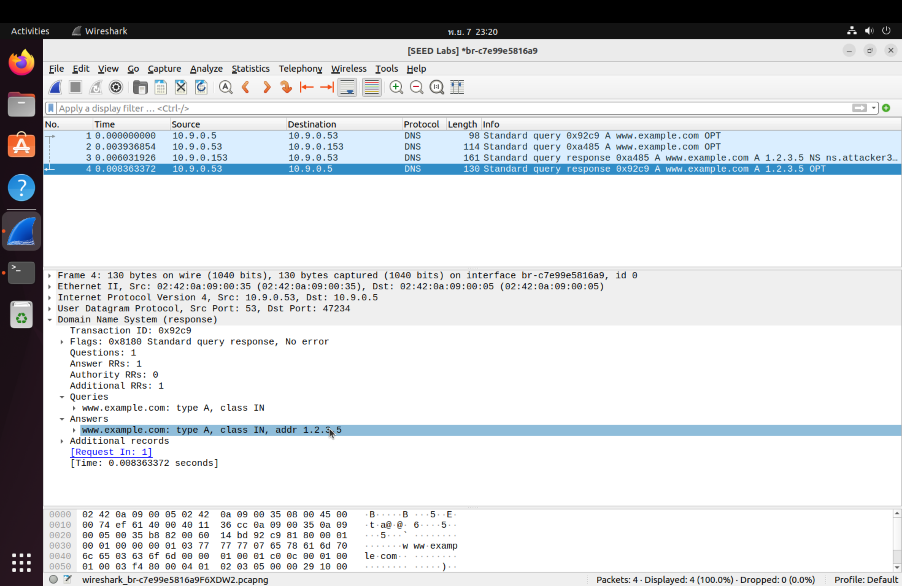

# The Kaminsky Attack Lab

For `Mac` with an Apple M-series chip

**VMware Fusion:** [VMware Fusion 13 Pro 13.5.2](https://customerconnect.vmware.com/en/evalcenter?p=fusion-player-personal-13) or [From my drive](https://drive.google.com/file/d/1r93EjCoikbehD6aaPDMhJCsoqPh11t2t/view?usp=sharing)

**VM version:** [SEED Ubuntu-20.04 VM](https://seedsecuritylabs.org/labsetup.html) or [From my drive](https://drive.google.com/file/d/1IPzOHrPnvwh5saghyQwFgCjSAsM2ZfZZ/view?usp=drive_link)

# Tasks 

- `User: 10.9.0.5`

- `Attacker: 10.9.0.1`

- `Local DNS Server: 10.9.0.53`

- `Attacker Name Server: 10.9.0.153`

## Tasks 1

In this task, we will check that our DNS setup is correct after running the `docker-compose.yml`

```
root@089b40180725:/# dig ns.attacker32.com                

; <<>> DiG 9.16.1-Ubuntu <<>> ns.attacker32.com
;; global options: +cmd
;; Got answer:
;; ->>HEADER<<- opcode: QUERY, status: NOERROR, id: 4865
;; flags: qr rd ra; QUERY: 1, ANSWER: 1, AUTHORITY: 0, ADDITIONAL: 1

;; OPT PSEUDOSECTION:
; EDNS: version: 0, flags:; udp: 4096
; COOKIE: 65d7fd29264015c2010000006730aa4c581950e715734d00 (good)
;; QUESTION SECTION:
;ns.attacker32.com.		IN	A

;; ANSWER SECTION:
ns.attacker32.com.	259200	IN	A	10.9.0.153

;; Query time: 2 msec
;; SERVER: 10.9.0.53#53(10.9.0.53)
;; WHEN: Sun Nov 10 12:42:52 UTC 2024
;; MSG SIZE  rcvd: 90
```

This confirms that the local DNS server recognizes ns.attacker32.com and associates it with the attacker’s IP address, which is `10.9.0.153`.

```
root@089b40180725:/# dig www.example.com

; <<>> DiG 9.16.1-Ubuntu <<>> www.example.com
;; global options: +cmd
;; Got answer:
;; ->>HEADER<<- opcode: QUERY, status: NOERROR, id: 13008
;; flags: qr rd ra; QUERY: 1, ANSWER: 1, AUTHORITY: 0, ADDITIONAL: 1

;; OPT PSEUDOSECTION:
; EDNS: version: 0, flags:; udp: 4096
; COOKIE: 91ccb2d5fbafe4f9010000006730a8bca9f36ecdddf59598 (good)
;; QUESTION SECTION:
;www.example.com.		IN	A

;; ANSWER SECTION:
www.example.com.	3600	IN	A	93.184.215.14

;; Query time: 1340 msec
;; SERVER: 10.9.0.53#53(10.9.0.53)
;; WHEN: Sun Nov 10 12:36:12 UTC 2024
;; MSG SIZE  rcvd: 88
```

The retrieved IP address `93.184.215.14` is the real IP address of `www.example.com`.

```
root@089b40180725:/# dig @ns.attacker32.com www.example.com

; <<>> DiG 9.16.1-Ubuntu <<>> @ns.attacker32.com www.example.com
; (1 server found)
;; global options: +cmd
;; Got answer:
;; ->>HEADER<<- opcode: QUERY, status: NOERROR, id: 32913
;; flags: qr aa rd ra; QUERY: 1, ANSWER: 1, AUTHORITY: 0, ADDITIONAL: 1

;; OPT PSEUDOSECTION:
; EDNS: version: 0, flags:; udp: 4096
; COOKIE: 0891da1527f17010010000006730aa72a534db8c62543202 (good)
;; QUESTION SECTION:
;www.example.com.		IN	A

;; ANSWER SECTION:
www.example.com.	259200	IN	A	1.2.3.5

;; Query time: 0 msec
;; SERVER: 10.9.0.153#53(10.9.0.153)
;; WHEN: Sun Nov 10 12:43:30 UTC 2024
;; MSG SIZE  rcvd: 88
```

We get a different IP address because the `Local DNS Server` is sending a request to `ns.attacker32.com` for the IP address of `www.example.com`. Since `ns.attacker32.com` is controlled by the attacker, it responds with a spoofed IP `(1.2.3.5)` for `www.example.com`, instead of the legitimate IP.

## Tasks 2

In this task, we want to know that we can trigger `Local DNS Server` by sending DNS query(we can do spoof DNS reply in the future)

Running [`task_2_dns_kaminsky.py`](https://github.com/tanasinp/SeedLab/tree/main/Network/dns_kaminsky/files/task_2_dns_kaminsky.py). And see the traffic in wireshark([`task_2.pcapng`](https://github.com/tanasinp/SeedLab/tree/main/Network/dns_kaminsky/wireshark/task_2.pcapng))...

[](https://github.com/tanasinp/SeedLab/tree/main/Network/dns_kaminsky/images/img_dns_kaminsky_task_2.png)

The `Attacker` send DNS query to the `Local DNS Server`, and it respond to the `Attacker` that the queried domain name wasn't found.

Checking by running the `dig` command:

```
root@c741d8b929dc:/# dig hbuaf.example.com

; <<>> DiG 9.16.1-Ubuntu <<>> hbuaf.example.com
;; global options: +cmd
;; Got answer:
;; ->>HEADER<<- opcode: QUERY, status: NXDOMAIN, id: 2133
;; flags: qr rd ra; QUERY: 1, ANSWER: 0, AUTHORITY: 1, ADDITIONAL: 1

;; OPT PSEUDOSECTION:
; EDNS: version: 0, flags:; udp: 4096
; COOKIE: 2cb7e213e4ba240601000000672c888f2bfe64eca6fa6e12 (good)
;; QUESTION SECTION:
;hbuaf.example.com.		IN	A

;; AUTHORITY SECTION:
example.com.		2827	IN	SOA	ns.icann.org. noc.dns.icann.org. 2024081446 7200 3600 1209600 3600

;; Query time: 2 msec
;; SERVER: 10.9.0.53#53(10.9.0.53)
;; WHEN: Thu Nov 07 09:29:51 UTC 2024
;; MSG SIZE  rcvd: 139
```
It returns an authoritative response of type `SOA`.

`ns.icann.org` is responsible for the example.com zone.

`noc.dns.icann.org` is responsible for authority's mailbox.
## Tasks 3

We need to know the legitimate IP address of `www.example.com`'s authoritative nameservers. We will use that IP address to spoofed DNS reply to the Local DNS Server.

```
root@c741d8b929dc:/# dig SOA www.example.com

; <<>> DiG 9.16.1-Ubuntu <<>> SOA www.example.com
;; global options: +cmd
;; Got answer:
;; ->>HEADER<<- opcode: QUERY, status: NOERROR, id: 39681
;; flags: qr rd ra; QUERY: 1, ANSWER: 0, AUTHORITY: 1, ADDITIONAL: 1

;; OPT PSEUDOSECTION:
; EDNS: version: 0, flags:; udp: 4096
; COOKIE: de2f2df223cde37901000000672c9046b4293e1327a5d85a (good)
;; QUESTION SECTION:
;www.example.com.		IN	SOA

;; AUTHORITY SECTION:
example.com.		3600	IN	SOA	ns.icann.org. noc.dns.icann.org. 2024081446 7200 3600 1209600 3600

;; Query time: 284 msec
;; SERVER: 10.9.0.53#53(10.9.0.53)
;; WHEN: Thu Nov 07 10:02:46 UTC 2024
;; MSG SIZE  rcvd: 137
```

It returns an authoritative response of type `SOA`.

`ns.icann.org` is responsible for the example.com zone.

`noc.dns.icann.org` is responsible for authority's mailbox.

Next, we send a direct query to `ns.icann.org` for `www.example.com` to retrieve the actual IP address.

```
root@c741d8b929dc:/# dig @ns.icann.org www.example.com

; <<>> DiG 9.16.1-Ubuntu <<>> @ns.icann.org www.example.com
; (1 server found)
;; global options: +cmd
;; Got answer:
;; ->>HEADER<<- opcode: QUERY, status: NOERROR, id: 62150
;; flags: qr aa rd; QUERY: 1, ANSWER: 1, AUTHORITY: 2, ADDITIONAL: 1
;; WARNING: recursion requested but not available

;; OPT PSEUDOSECTION:
; EDNS: version: 0, flags:; udp: 4096
;; QUESTION SECTION:
;www.example.com.		IN	A

;; ANSWER SECTION:
www.example.com.	3600	IN	A	93.184.215.14

;; AUTHORITY SECTION:
example.com.		86400	IN	NS	a.iana-servers.net.
example.com.		86400	IN	NS	b.iana-servers.net.

;; Query time: 203 msec
;; SERVER: 199.4.138.53#53(199.4.138.53)
;; WHEN: Thu Nov 07 10:05:47 UTC 2024
;; MSG SIZE  rcvd: 108
```

The `ANSWER SECTION` provides the IP address `93.184.215.14` for `www.example.com`, confirming the legitimate address.

The `AUTHORITY SECTION` lists additional nameservers (`a.iana-servers.net` and `b.iana-servers.net`) as authoritative servers for example.com.

With this information, we can find their IP address by using `dig` command:

```
root@c741d8b929dc:/# dig a.iana-servers.net

; <<>> DiG 9.16.1-Ubuntu <<>> a.iana-servers.net
;; global options: +cmd
;; Got answer:
;; ->>HEADER<<- opcode: QUERY, status: NOERROR, id: 3974
;; flags: qr rd ra; QUERY: 1, ANSWER: 1, AUTHORITY: 0, ADDITIONAL: 1

;; OPT PSEUDOSECTION:
; EDNS: version: 0, flags:; udp: 4096
; COOKIE: 4d0d8141a84f6da401000000672c914a507cfa9916c51e1d (good)
;; QUESTION SECTION:
;a.iana-servers.net.		IN	A

;; ANSWER SECTION:
a.iana-servers.net.	1800	IN	A	199.43.135.53

;; Query time: 320 msec
;; SERVER: 10.9.0.53#53(10.9.0.53)
;; WHEN: Thu Nov 07 10:07:06 UTC 2024
;; MSG SIZE  rcvd: 91

root@c741d8b929dc:/# dig b.iana-servers.net

; <<>> DiG 9.16.1-Ubuntu <<>> b.iana-servers.net
;; global options: +cmd
;; Got answer:
;; ->>HEADER<<- opcode: QUERY, status: NOERROR, id: 46387
;; flags: qr rd ra; QUERY: 1, ANSWER: 1, AUTHORITY: 0, ADDITIONAL: 1

;; OPT PSEUDOSECTION:
; EDNS: version: 0, flags:; udp: 4096
; COOKIE: 21a553a24a70a2b001000000672c91555a977c3f0f223517 (good)
;; QUESTION SECTION:
;b.iana-servers.net.		IN	A

;; ANSWER SECTION:
b.iana-servers.net.	1512	IN	A	199.43.133.53

;; Query time: 0 msec
;; SERVER: 10.9.0.53#53(10.9.0.53)
;; WHEN: Thu Nov 07 10:07:17 UTC 2024
;; MSG SIZE  rcvd: 91
```

The IP address for `a.iana-servers.net` is `199.43.135.53`.

The IP address for `b.iana-servers.net` is `199.43.133.53`.

We will send a request to the `Local DNS Server` which will trigger a DNS request, and the `Attacker` will send the spoofed reply. 

Running [`task_3_dns_kaminsky.py`](https://github.com/tanasinp/SeedLab/tree/main/Network/dns_kaminsky/files/task_3_dns_kaminsky.py). And see the traffic in wireshark([`task_3.pcapng`](https://github.com/tanasinp/SeedLab/tree/main/Network/dns_kaminsky/wireshark/task_3.pcapng))...

[](https://github.com/tanasinp/SeedLab/tree/main/Network/dns_kaminsky/images/img_dns_kaminsky_task_3.png)

We see packet number 3 that the `Attacker(10.9.0.1)` send the request to `Local DNS Server(10.9.0.53)`.

The spoofed replies can be seen in packets number 6 and 7.

## Tasks 4

The python script might be too slow to carry on this attack. To fix this issue, we will use the code skeleton for the C code. Using hybrid approach, we will use Scapy to generate DNS packet template and use C to send out the packet.

Compling C script by this command:

```
gcc -static -o attacker attack.c
```

Runing the [`attack`](https://github.com/tanasinp/SeedLab/tree/main/Network/dns_kaminsky/files/attack) and check the `Local DNS Server`'s cache.

```
root@132ec0a0c870:/# rndc dumpdb -cache && grep attacker /var/cache/bind/dump.db
root@132ec0a0c870:/# rndc dumpdb -cache && grep attacker /var/cache/bind/dump.db
ns.attacker32.com.	615600	\-AAAA	;-$NXRRSET
; attacker32.com. SOA ns.attacker32.com. admin.attacker32.com. 2008111001 28800 7200 2419200 86400
example.com.		777599	NS	ns.attacker32.com.
; ns.attacker32.com [v4 TTL 1800] [v6 TTL 10800] [v4 success] [v6 nxrrset]
```
And see the traffic in wireshark([`task_4.pcapng`](https://github.com/tanasinp/SeedLab/tree/main/Network/dns_kaminsky/wireshark/task_4.pcapng))...

[](https://github.com/tanasinp/SeedLab/tree/main/Network/dns_kaminsky/images/img_dns_kaminsky_task_4.png)

The attack was successful because the `Local Dns Server(10.9.0.53)` interacting with `ns.attacker32.com(10.9.0.153)` as if it were the legitimate authoritative server. The `Local DNS Server`’s cache has been poisoned, causing it to trust and query the attacker’s nameserver for further information about example.com.


## Tasks 5

In this task, we will observe the result of the Kaminsky attack by verifying that the `Local DNS Server (10.9.0.53)` has cached the spoofed IP address for `www.example.com `provided by the `Attacker’s Nameserver (10.9.0.153)`.

```
root@c741d8b929dc:/# dig www.example.com

; <<>> DiG 9.16.1-Ubuntu <<>> www.example.com
;; global options: +cmd
;; Got answer:
;; ->>HEADER<<- opcode: QUERY, status: NOERROR, id: 12035
;; flags: qr rd ra; QUERY: 1, ANSWER: 1, AUTHORITY: 0, ADDITIONAL: 1

;; OPT PSEUDOSECTION:
; EDNS: version: 0, flags:; udp: 4096
; COOKIE: 4679a9e5729d113e01000000672cdf2cba39256819f2ec78 (good)
;; QUESTION SECTION:
;www.example.com.		IN	A

;; ANSWER SECTION:
www.example.com.	259200	IN	A	1.2.3.5

;; Query time: 6 msec
;; SERVER: 10.9.0.53#53(10.9.0.53)
;; WHEN: Thu Nov 07 15:39:24 UTC 2024
;; MSG SIZE  rcvd: 88
```

And see the traffic in wireshark([`task_5_1.pcapng`](https://github.com/tanasinp/SeedLab/tree/main/Network/dns_kaminsky/wireshark/task_5_1.pcapng))...

[](https://github.com/tanasinp/SeedLab/tree/main/Network/dns_kaminsky/images/img_dns_kaminsky_task_5_1.png)

1. The `User(10.9.0.5)` initiates a DNS query to the `Local DNS Server(10.9.0.53)` for the IP address of `www.example.com`.
2. The `Local DNS Server(10.9.0.53)` forwards the query to the `Attacker's Nameserver(10.9.0.153)`.
3. The `Attacker’s Nameserver(10.9.0.153)` responds to the `Local DNS Server(10.9.0.53)` with a spoofed IP address, `1.2.3.5`, for www.example.com.
4. After receiving the response from the `Attacker’s Nameserver`, the `Local DNS Server` caches this spoofed IP (`1.2.3.5`) for `www.example.com`.
```
root@c741d8b929dc:/# dig @ns.attacker32.com www.example.com

; <<>> DiG 9.16.1-Ubuntu <<>> @ns.attacker32.com www.example.com
; (1 server found)
;; global options: +cmd
;; Got answer:
;; ->>HEADER<<- opcode: QUERY, status: NOERROR, id: 22871
;; flags: qr aa rd ra; QUERY: 1, ANSWER: 1, AUTHORITY: 0, ADDITIONAL: 1

;; OPT PSEUDOSECTION:
; EDNS: version: 0, flags:; udp: 4096
; COOKIE: 5765d955695eea6901000000672ce01dc287a30d8037a73b (good)
;; QUESTION SECTION:
;www.example.com.		IN	A

;; ANSWER SECTION:
www.example.com.	259200	IN	A	1.2.3.5

;; Query time: 1 msec
;; SERVER: 10.9.0.153#53(10.9.0.153)
;; WHEN: Thu Nov 07 15:43:25 UTC 2024
;; MSG SIZE  rcvd: 88
```

And see the traffic in wireshark([`task_5_2.pcapng`](https://github.com/tanasinp/SeedLab/tree/main/Network/dns_kaminsky/wireshark/task_5_2.pcapng))...

[](https://github.com/tanasinp/SeedLab/tree/main/Network/dns_kaminsky/images/img_dns_kaminsky_task_5_2.png)

1. The `User(10.9.0.5)` sends a query for `www.example.com` to the `Local DNS Server(10.9.0.53)`.
2. The `Local DNS Server` forwards this query to the `Attacker’s Nameserver` (ns.attacker32.com at 10.9.0.153).
3. The `Attacker’s Nameserver` responds with the spoofed IP address `1.2.3.5` for `www.example.com`.
4. Finally, the `Local DNS Server` caches this response and returns `1.2.3.5` to the User as the IP for` www.example.com`.